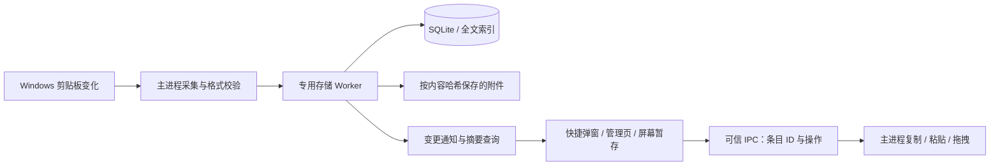

# 随身仓剪贴板完整修改方案

设计基准：uTools 团队开发的官方「剪贴板」。以快捷调用、历史查找、合并复制、直接粘贴、悬浮中转为核心。本文件描述目标体验与验收要求，不代表功能已经实现。

视觉修订：用户提出「先补几张 UI 界面设计图，然后按图开发」，界面外观按 [v3 设计图与实现规范](./design/clipboard/README.md) 更新。该修订覆盖本文件早期的行高、工具栏位置和窄屏布局细节，核心功能与数据验收要求继续保留。

官方来源：[uTools 官方剪贴板介绍](https://www.u-tools.cn/plugins/detail/%E5%89%AA%E8%B4%B4%E6%9D%BF/index.html)，核对日期：2026-09-09。官方页面确认了鼠标选中、多选、双击粘贴、右键操作、图像及文件拖拽和键盘操作。下述窗口尺寸、存储策略、快捷键细节和可靠性设计是 Piora 的推荐方案，不能理解为官方插件的实现细节。

## 1. 产品方向与推荐决策

用户主任务：在任何应用中，快速找回复制过的内容，放回正在编辑的位置，继续工作。

采用三个互通的界面：

| 界面 | 主要用途 | 推荐行为 |
| --- | --- | --- |
| 快捷弹窗 | 找到一条或几条内容，立即使用 | 全局快捷键打开，搜索自动聚焦，执行粘贴后隐藏 |
| 随身仓管理页 | 预览、整理、编辑副本、批量操作、数据管理 | 保留筛选与浏览位置，可调整列表和详情宽度 |
| 屏幕暂存 | 把本次工作要反复用的内容放在屏幕边上 | 独立置顶小窗，关闭只隐藏，内容持久保存 |

推荐默认值：Windows 优先；快捷键 Ctrl+Alt+V，可改键并提示冲突；粘贴保留已保存的格式；Shift+Enter 使用纯文本；历史长期保留；初始内容容量预算 1 GiB；90% 提醒，容量不足暂停新增；回收站保留 7 天。

「屏幕暂存」与现有「中转站」各司其职：前者保存本次工作中的可重复使用条目，后者承接主动整理的笔记和素材。通过「存入中转站」连接二者。退出后重新启动，暂存内容恢复，窗口默认隐藏。

本轮范围不含 OCR、顺序粘贴队列、云同步、脚本执行及自动 AI 处理。先把官方核心使用链路做完整。

## 2. 现有实现的缺陷与修改方向

以下来自当前入口与代码检查：`desktop/src/main.ts` 仍连接旧版 ClipboardService；新版数据库、worker、运行服务文件已经存在，但尚不能据此认定新体验已完成。

| 当前问题 | 用户影响 | 修改要求 |
| --- | --- | --- |
| 快捷键打开随身仓中的页面 | 为一次粘贴切换整个工作空间 | 增加独立、可复用的快捷窗口 |
| Enter 和双击仅写入剪贴板 | 用户还需切回原应用再次粘贴 | 记住调用前窗口，恢复焦点并执行一次粘贴 |
| 首屏标题、宣传文案和大行卡片占空间 | 同屏可见记录少，查找距离长 | 搜索置顶，紧凑记录，动作随上下文出现 |
| 每秒读取一次，文字优先 | 快速复制可能遗漏；图片或富格式可能丢失 | Windows 使用变化通知，同一次记录保留兼容格式集合 |
| 只有文字、链接、图片 | 文件与文件夹工作流中断 | 增加文件集合与拖拽，检查文件是否存在 |
| 500 条、30 天、32 MB 的淘汰规则 | 历史找不回，难以信任长期保存 | 取消默认条数与日期淘汰，改为容量预算与明确清理 |
| 改搜索/筛选会清空多选 | 跨类型查找和整理反复重来 | 保留独立选择集合，明确顺序和合并结果 |
| 删除不能撤销 | 整理时容易误删 | 回收站、撤销、暂存引用保护 |
| 列表两秒轮询，备注失焦保存 | 刷新延迟；失败时输入可能被旧值覆盖 | 事件推送、请求代次隔离、保留未保存输入 |
| 历史独立于应用备份 | 换机可能遗漏数据 | 专用导入导出并接入应用加密备份 |

## 3. 快捷弹窗

### 布局

默认 760 × 540 DIP，按目标窗口所在屏幕定位并限制在工作区内。无大标题；首屏主要空间留给记录。窗口已加载时复用，不在每次唤起时重新创建。

```text
┌──────────────────────────────────────────────────────────┐
│ 搜索内容或备注…                 暂停记录  屏幕暂存  管理 │
│ 全部   文字   图片   文件   收藏                  预览 ▸ │
├──────────────────────────────────────────────────────────┤
│ 文  项目启动说明…                  编辑器 · 刚刚      ☆ │
│ 图  界面截图                       浏览器 · 2 分钟前    │
│ 件  3 个文件                       资源管理器 · 5 分钟前│
│ 文  常用地址…                      浏览器 · 昨天      ★ │
│                                                          │
├──────────────────────────────────────────────────────────┤
│ Enter 粘贴   Shift+Enter 纯文本   Ctrl+C 复制    当前目标│
└──────────────────────────────────────────────────────────┘
```

默认隐藏预览，Alt+P 展开右侧详情；展开不改变屏幕定位，也不抢搜索焦点。记录行约 52 DIP：类型图标或缩略图、两行以内摘要、来源和时间；收藏状态使用小标记。选中、键盘焦点、多选勾选必须可区分。

每次重新唤起：清空上次搜索、多选及临时弹层，展示最新记录，搜索聚焦。管理页保留自己的状态，不受此重置影响。

### 操作规则

| 输入 | 行为与边界 |
| --- | --- |
| 单击 | 切换当前条目；显示详情，不执行粘贴 |
| 双击 / Enter | 对当前条目或选择集合执行粘贴；不向目标应用发送 Enter |
| Shift+Enter | 使用纯文本粘贴；无法转换的图片或文件显示原因 |
| Ctrl+C | 复制选中条目；预览中有文本选区时优先复制选区 |
| ↑ / ↓ | 搜索框或记录列表中移动当前条目，并滚动至可见 |
| Space | 仅当列表获得焦点时切换多选；在输入框中正常输入空格 |
| Ctrl+单击 / Shift+单击 | 独立切换选择 / 选择连续范围 |
| Ctrl+F / / | 聚焦搜索；输入框内的斜杠按普通文字处理 |
| Ctrl+Tab | 切换类型；Tab 保留正常可访问焦点顺序 |
| Delete | 列表焦点下移入回收站；编辑框中正常删除字符 |
| Esc | 依次关闭弹层、取消多选、清空搜索，最后隐藏窗口 |
| Alt+P | 切换预览 |

输入法组合输入期间不触发搜索导航或粘贴。右键打开当前条目的上下文菜单；对已多选条目右击时保留选择集合。菜单、拖拽、保存对话框期间不因临时失焦误隐藏。

新复制到达时：在最新列表顶部且未选择时直接更新；正在查看旧内容、搜索或多选时保留当前列表位置和选择，显示「新增 N 条」，点击后刷新。不得让新记录挤走即将粘贴的选中项。

## 4. 管理页与内容预览

管理页采用搜索、筛选栏、可调整宽度的列表与详情、按需显示的批量栏。去掉现有宣传标题及固定大留白。沿用 Piora 的背景、文字、边框、强调色和字体变量，支持浅色与深色，不另建一套视觉语言。

类型：全部、文字（包含链接）、图片、文件、收藏、回收站。可组合关键词、来源应用和日期范围。来源与日期放入筛选按钮，活动筛选显示为可移除条件。保存查询、类型、来源、时间、列表位置和详情宽度；窄屏切为列表/详情单页前进返回，返回恢复位置。

| 内容 | 列表 | 详情与操作 |
| --- | --- | --- |
| 文字 / 链接 | 匹配位置摘要和高亮；链接显示域名 | 可选中局部复制；完整内容；字符数与行数；主动打开链接 |
| HTML / RTF | 显示文字摘要及富文本标记 | 原格式可用性说明；安全富文本预览与纯文本切换；保留原始格式用于粘贴 |
| 图片 | 小缩略图、尺寸、容量 | 棋盘背景、适应窗口/100%/缩放；复制、拖出、另存为 |
| 文件 / 文件夹集合 | 前几个名称与总数 | 名称、类型、路径、存在状态；定位文件；复制集合与拖出 |

富内容预览禁止脚本、表单、外部字体、远程图片和自动导航；保存 HTML/RTF 与安全预览是不同步骤。无法可靠展示 RTF 时提供文字预览与格式说明，不能把源代码当作正常预览。

备注使用独立字段，不替换原内容。保存过程显示状态；失败保留输入并可重试。编辑内容采用「编辑为新记录」，保存后选中新记录，原记录不变。切换条目前对未保存编辑提供明确处理。

## 5. 多选、合并与屏幕暂存

多选集合跨搜索和筛选保留。底栏显示选择数量、顺序列表和清空入口，选择顺序即合并顺序；支持拖动或按钮调整顺序。执行前可预览结果。已删除、失效或不可合并的条目应明确指出。

- 多条文字：换行（默认）、空行、空格、逗号或自定义分隔符；合并为纯文本，明确显示该结果格式。
- 多条图片：转换为临时 PNG 文件集合，供接受文件的目标粘贴或拖入；不暗示会自动拼成一张图片。
- 文件与图片：按顺序组成文件集合，保留已有文件引用，检查缺失文件。
- 文字与图片/文件混选：允许收藏、删除、暂存等管理动作；合并粘贴显示不兼容原因，提供分组使用入口。

屏幕暂存默认约 360 × 420 DIP，可调整尺寸、位置，记住显示器与几何信息。内容顺序可调整；每条支持复制、粘贴、拖出、移除。关闭窗口只隐藏，移除暂存项不删除历史，删除历史也不使仍在暂存中的内容失效。

拖出原文件使用文件引用；拖出图片由主进程准备临时 PNG，至少保留 24 小时再清理。读取历史文件条目一律按复制处理，不重放来源应用当时的剪切标记。源文件被移动或删除时明确报错，避免静默丢项。

## 6. 记录、保留与隐私

首次使用自动记录默认关闭；通过明确的「开启记录」开始。随身仓隐藏仍继续记录，退出应用停止。随时暂停；锁屏暂停；恢复时建立新基线，不补录暂停或锁屏期间留在系统剪贴板中的内容。

一次系统复制产生一条记录，可同时包含 text、HTML、RTF、PNG、文件列表。类型只决定展示，不用于丢弃其他表示。相同完整格式集合去重，更新最近复制时间和次数，保留备注、收藏及暂存位置；文字相同但富格式不同的记录分别保存。自身写入的剪贴板内容不得产生反馈循环。

支持按文字、图片、文件开关记录，按来源程序排除。遵守来源应用提供的不记录标记。无法判定来源时标记「来源未知」，不能伪造应用名称。默认只在本机保存，任何内容不会自动送给模型。

历史默认长期保存，不按 500 条或 30 天淘汰。容量预算默认 1 GiB，可调整；单条文字 2 MiB，单次内容载荷 64 MiB。预算按内容与附件计量，数据库、索引及旧备份的实际磁盘占用另行显示，避免把预算误称为总磁盘上限。

达到 90% 提示；新记录无法纳入预算时暂停新增，继续允许搜索、复制、导出、清理。界面提供增加预算或整理数据的入口，不自动删历史。清理历史默认保护收藏，并先进入回收站；批量操作明确数量和范围。

删除提供撤销；回收站 7 天后清除。仍被屏幕暂存引用的内容继续保存，最后一个引用解除后才可回收附件。清空回收站与永久删除需要明确提示影响，不能连带删除暂存内容。

## 7. 原生粘贴与异常反馈

唤起之前记录目标窗口，由主进程生成短期目标标识；渲染层不传任意窗口句柄。粘贴时准备格式、隐藏弹窗、恢复目标、核验前台窗口、等待用户释放修饰键，再发送一次 Ctrl+V。仅在请求对象仍有效时执行。

| 情况 | 用户看到的结果 |
| --- | --- |
| 正常发送粘贴输入 | 隐藏快捷弹窗；不能声称已验证目标应用实际接收 |
| 目标关闭、焦点恢复失败 | 提示目标不可用；内容已复制，可手动粘贴 |
| 权限差异阻止模拟输入 | 提示当前应用无法直接粘贴；保留复制方案 |
| 修饰键一直未释放 | 取消自动输入并提示，不带着 Ctrl/Alt/Shift 误操作目标 |
| 无原生能力 | 清楚显示仅复制/拖拽等可用动作，不显示虚假的粘贴成功 |
| 剪贴板暂时被占用 | 有限重试；持续失败显示状态与恢复入口 |
| 记录服务降级为轮询 | 显示降级状态；不得继续宣称原生事件监听正常 |
| 磁盘满、超预算、存储失败 | 显示原因和处理入口；不把未持久保存的数据显示为已记录 |
| 搜索空结果 | 保留筛选条件，提供清空条件入口 |
| 旧数据损坏 | 保留原文件，报告跳过条目及恢复结果 |

## 8. 工程修改边界



| 修改范围 | 责任 |
| --- | --- |
| `desktop/src/main.ts` | 服务启动、快捷键、窗口生命周期、退出收尾；替换旧服务接线 |
| `clipboard-types.ts`、`preload.ts`、sidebar 类型声明 | 统一 typed bridge，主进程逐项验证输入、来源与权限 |
| `clipboard-windows.ts`、`clipboard-runtime.ts` | 原生监听、来源、格式快照、排除规则、目标恢复、写入抑制 |
| `clipboard-database.ts`、`clipboard-worker.ts`、`clipboard-store.ts` | 持久化、查询、迁移、预算、引用与回收；重工作脱离主进程 |
| 新增窗口控制模块及桌面剪贴板页面 | 快捷弹窗与暂存窗口、可信来源、图片访问、拖拽准备 |
| `ClipboardWorkbench.tsx` 及拆分组件 | 管理页、复用列表/预览/批量操作；独立于聊天列表的滚动逻辑 |
| `CompanionPanel.tsx` | 剪贴板入口命名、管理页承载与中转站联通 |
| 应用备份模块与桌面桥接 | 一致性快照、包含附件的加密应用备份、恢复与迁移 |
| 文案、文档、第三方声明、测试 | 中英文界面、快捷键说明、依赖打包与可追溯验收 |

数据库使用 SQLite WAL；二进制附件按内容哈希保存，列表只传摘要。图片走应用限定的资源通道，不向渲染器开放任意本地路径。详情与缩略图按需读取，虚拟列表限制实际 DOM 数量。

查询每页 100 条并使用稳定游标。3 字符及以上使用 trigram 全文索引；1～2 字符采用可取消的分段扫描。新查询能中止或让位于旧查询，结果绑定请求代次；不能仅在界面丢弃结果、却让旧扫描长时间占用 worker。

旧 `history.json` 原样保留；迁移保留 ID、时间、收藏、标题等元数据，逐条恢复并报告错误，重启重试不得复制一份数据。数据库升级先检查版本，写入失败可回退，不覆盖不可解析的旧档案。

导出包含内容、格式、附件、备注、收藏与暂存顺序。导入先校验、计算容量与冲突策略，再合并；同内容保留已有用户备注，冲突明确报告。路径、归档条目及资源大小均校验；失败不留下半导入状态。应用加密备份使用一致性快照，不能只复制正在写入的 SQLite 主文件而遗漏 WAL。

## 9. 实施顺序与完成条件

四阶段均属于本次完整范围，阶段完成不等于整体完成。

1. 数据与捕获：迁移、完整格式、来源、排除、预算、锁屏与暂停、新旧服务切换、损坏恢复。先证明数据不会因为升级丢失。
2. 快速取用：专用弹窗、目标捕获与粘贴、复制、搜索、键盘与输入法、文件/图片拖拽。打通「复制 → 唤起 → 找到 → 粘贴 → 继续工作」。
3. 整理与复用：管理页、类型预览、收藏、备注、新副本、跨筛选多选、合并、屏幕暂存、回收站、中转站、导入导出与应用备份。
4. 全体验验收：视觉、可访问性、大数据性能、真实跨应用、安装包与升级回归；更新用户文档，移除过时的旧限制及旧测试假设。

## 10. 验收清单

### 必须实际走通的场景

- 在浏览器、编辑器、聊天输入框、资源管理器分别复制和复用文字、格式化内容、截图、文件和文件夹；快速连续复制时核对内容及次序。
- Enter 粘贴到调用前的位置且不发送消息；Shift+Enter 只写纯文本；目标关闭、权限不同和修饰键未释放均有正确结果。
- 同一条文字不同格式分别保存；完整相同内容重复制更新次数和时间；收藏与备注保持；自己复制不循环新增。
- 在旧记录处浏览、编辑或多选时复制新内容，不跳位置、不换选中项、不覆盖草稿。
- 搜索长文本中部、中文 1/2/3 字关键词、符号及备注；快速改查询不会展示旧结果。
- 多选跨筛选仍保留、顺序可改、合并预览与输出一致；混合格式与丢失文件明确处理。
- 暂存窗口关闭和应用重启后内容仍在；历史删除不损坏暂存；移除暂存不删除历史。
- 数据超过 500 条、时间超过 30 天仍可找回；容量不足无静默淘汰；删除、撤销及 7 天回收规则一致。
- 原有 `history.json` 正常、部分损坏、全损坏和迁移中断重启分别测试；导入/导出和应用加密备份还原逐项比对。
- 锁屏、暂停及恢复不补录旧内容；应用排除和类型开关生效；日志与诊断不包含剪贴板正文。

### UI 与性能

浅色、深色、快捷弹窗收起/展开预览、多选、暂存、错误状态均保存截图；测试 100%/125%/150%/200% 缩放、不同显示器、小工作区、全键盘和中文输入法。窄屏无水平溢出、重要动作无悬停依赖。

以明确记录的 Windows 测试机、数据规模及缓存状态测量 10 万条历史：暖启动唤起至搜索可输入 p95 ≤ 200 ms；普通索引搜索首屏 p95 ≤ 200 ms；短关键词首屏 p95 ≤ 500 ms；采集后可见 p95 ≤ 200 ms。冷启动单列报告，不能混入暖启动达标结论。大图编码、文件集合、存储拥塞单列测量，不能用纯文字场景代替。

记录测试硬件、数据生成分布、样本数、内存基线/峰值、渲染行数和失败次数。滚动加载不无限保留完整正文或图片；长时间使用无持续增长的缓存、句柄或 worker 请求队列。

验证组合：存储及运行服务测试、worker 集成、浏览器交互、真实 Windows 跨应用、最终安装包。模拟 IPC 的浏览器测试只能证明界面逻辑；桌面编译通过不能代替真实粘贴和打包原生依赖验收。开发期间不运行 `next build`。

执行记录见 [Clipboard v2 implementation ledger](./clipboard-v2-implementation.md)。只有实现接入、对应测试与真实体验证据齐全后，才勾选交付项。

### 用户调整的交付验收标准（2026-09-10，优先于上述严格测试门槛）

用户明确接受十万条记录约 200 ms 的体验，并要求停止继续优化；随后要求验证不必严苛，以日常使用基本顺畅为准。因此，200 ms 不再作为严格阻断交付的 p95 门槛，不继续为少量尾部延迟做优化或重复压测。保留原始测量结果，不把未达原门槛的结果改写为达标。

后续以主要流程可用、界面与设计一致、没有明显影响使用或数据保存的问题为交付依据。此前列出的穷举应用、物理显示器/DPI、极限压力与长时间资源矩阵作为可选后续检查，不再逐项阻断交付。已有测试证据继续有效；只对已发生的改动做必要收尾，不重复扩大验证范围。
