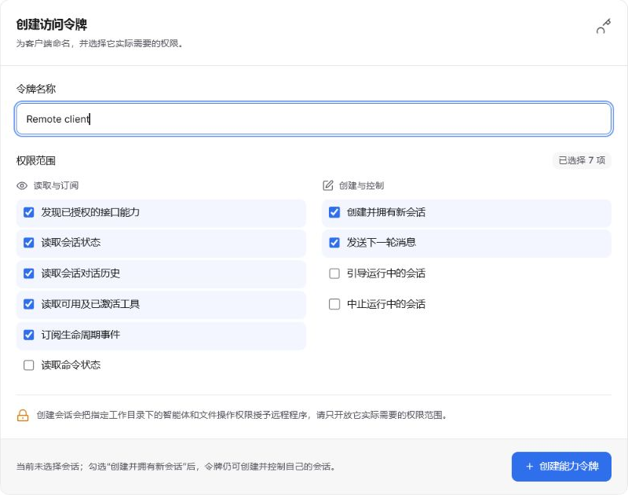

# Piora 独立扩展 HTTP API

独立运行的程序通过 `http://127.0.0.1:<Piora 端口>/api/remote/v1` 与 Piora 通信。基础地址和令牌可在 **设置 → 远程控制** 中取得。令牌只显示一次；服务端只保存其 SHA-256 摘要。

## 本机服务登记（2026-09-10）

Node instrumentation 启动时读取实际 PORT，在当前系统用户 ~/.piora/services 写入 pid-instanceId.json。登记协议为 piora.remote.discovery.v1/version=1，仅包含 address、serverId、instanceId、pid、updatedAt、expiresAt；没有令牌、会话内容或工作目录。监听地址只发布回环，端口不从请求 Host 推断；缺少有效端口不发布。登记写入异步启动，不阻塞正常手动连接。

每 20 秒以私有原子文件续期，有效期 90 秒；globalThis 共享进程启动，正常退出尝试删除自己的记录，强制退出残留由客户端按时间/身份过滤，不删除其他实例的记录。发布失败不关闭 Remote API，续期失败停止登记；修复后需重启服务。PIORA_DISCOVERY_DIR 可改发现目录，PIORA_DISCOVERY_DISABLED=1 禁止发布；改变环境配置后需重启。默认目录独立于 PIORA_HOME/Agent 数据目录。

插件仅在用户请求发现时读取登记，最多 128 项、16 候选、2 并发、每次匿名探测 2 秒；登记/身份响应各 4 KiB，不扫端口、不发送 Bearer、不跟随重定向。展示前比较 /identity.serverId，选择时二次确认和复核，不自动迁移凭证/回执/会话选择。源目录/文件拒绝检出的链接，POSIX 校验当前所有者/私有权限；Windows 依赖用户目录 ACL，未提供 ACL 审计或密码学服务认证，不防恶意同用户伪造。

验证：租期续写、进程启动共享、只移除自身登记、目录链接拒绝、读取/探测限额、身份不符/过期、显式选择与保存失败测试；隔离 Next 启动实际发布登记，插件读取并匿名核验得到相同地址与 serverId。真实 Obsidian UI、实际已安装桌面包升级和多进程压力仍待验收。

## 图片消息能力（2026-09-10）

capabilities.features.messageImages=base64-images-v1 显式声明 messages/steer 支持可选 images 数组，每项为 type=image、mimeType、data（不含 data URL 前缀的 Base64）。继续使用原消息/引导 scope 和同一幂等键规则；这是消息协议扩展声明，不是通用文件上传接口，也不接受客户端任意文件路径作为上传来源。

Remote 单次完整 JSON 限额仍为 256 KiB，Base64 与全部元数据/转义计入限额，不采用核心 UI 的较大图片限额。配套 Obsidian 插件另限制单附件原始大小 128 KiB、最多 8 项，并在发送前检查完整请求。文本附件放在不可信 content 段；插件不会把 Base64 拼成提示词。

AgentSessionWrapper 在显式 prompt、steer、follow_up 图片输入时检查当前模型是否声明 image 输入；文本模型或缺失能力时明确失败，不静默丢图片、不自动切换模型。排队消息的失败应从命令回执状态核对，202 仍只代表接受投递，不是模型成功处理。

验证：插件同键/同图片重试及全请求限额测试；隔离 HTTP 使用合成图片/文本，真实 SDK 向合成视觉模型提交 image_url 和文本，丢失回执后同一 commandId 恢复且仅一次调用。文本模型拒绝图片且未调用模型。服务端相关回归 81 项、类型检查与 lint 通过；无真实笔记、付费模型或 next build。

## 鉴权与安全边界

除只返回协议与身份的 GET /identity 外，每个 Remote 请求都要携带：

```http
Authorization: Bearer <能力令牌>
```

令牌同时受作用域和 Session 白名单约束。具有 `session.create` 的令牌创建 Session 后，Piora 会自动把新 Session 加入该令牌的白名单。创建接口不能覆盖进程的 `runtimeProfile`，浏览器与鸿蒙扩展按当前 Piora 运行配置尽力加载，不会因它们加载失败而拒绝创建 Session。

`session.create` 受每令牌创建模式与工作目录策略约束；允许 agent 时仍可能启动完整工具能力。工作目录限制不是工具文件访问沙箱，令牌仍只签发给可信本机程序，不要将端口直接暴露到公网。

### 每令牌创建策略与生命周期撤销（2026-09-10）

- 管理端 POST /api/remote/tokens 接受 creationPolicy={allowedPolicies:["notes"],cwdRoots:["D:/example-vault"]}。新创建令牌省略该字段时默认 notes-only、空目录列表（拒绝全部新建），不会隐式允许全盘。每行目录必须存在，签发时保存真实路径，最多 16 个根。
- 创建时按真实路径校验目录及子目录，拒绝 agent 模式越权、目录越界、junction/符号链接逃逸及已保存根被重定向；每次重新读取令牌当前策略。失败返回 403 REMOTE_CREATION_DENIED，不暴露内部文件路径错误。省略会话 policy 仍按 agent 解析，notes-only 客户端必须显式传 notes。
- 设置界面默认不绑定当前会话，需另外勾选授权。限制只控制新建，不降级已明确授权的 Agent 会话，不是操作系统沙箱；创建期间撤销会尽力销毁未能授权的 wrapper，不承诺回滚已发生的扩展副作用。
- 旧记录缺少 creationPolicy 时保留历史兼容能力，界面显示警告，需撤销重发；坏策略记录会被排除认证，不回退到兼容态。
- /capabilities 的 sessionCreation 返回 allowedPolicies、cwdRoots、legacyUnrestricted。cwdRoots=null 表示无已保存策略，不代表受限；features.sessionPolicies 只表示服务器支持模式，并非令牌授权。
- 生命周期 /events 的 snapshot、重放/live 事件和心跳输出前复核授权，空闲每秒检查，失权发 REMOTE_ACCESS_ENDED 并关闭。取消/abort/状态读取失败释放订阅及定时器。已进入网络缓冲的数据不能撤回，事件循环阻塞会延迟检查。
- 生命周期流最多缓存 128 条重放期间事件、单帧 64 KiB、输出队列 256 KiB（另允许一个固定终止帧）。超限发送 stream.reset / REMOTE_STREAM_BACKPRESSURE 后关闭；客户端须重连并 HTTP 校准。游标、snapshot 与既有事件格式保持兼容。

验证：创建策略 8 项、设置界面 5 项、生命周期流 9 项通过；前一轮 Remote/运行时/消息路由回归 69 项通过后，新增 2 项游标与异步清理检查通过。TypeScript 与 lint 通过，未运行 next build。插件 95 项及隔离真实 Next HTTP 集成通过，验证模式/目录/默认拒绝、正常队列恢复及正文/生命周期双流撤销，仍仅 3 次合成模型请求，无真实笔记或收费模型。

## 推荐调用流程

### 创建回执恢复与令牌身份（2026-09-10）

/capabilities 的 authentication.capabilityId 返回当前已认证令牌的公开记录 ID，不是令牌值或摘要，单独持有它不获得权限。恢复创建的客户端应将原参数、幂等键及该 ID 在请求前持久化，并在 POST /sessions 附加 X-Piora-Capability-Id。认证出的令牌与期望 ID 不匹配时返回 409 REMOTE_CAPABILITY_CHANGED，避免相同创建键被错误地归到另一枚令牌。旧调用者可不带此头，但不具备此项归属保护。

Obsidian 回执接收 sessionId 后再次落盘，最近会话选择持久化后才清理。响应丢失后重建客户端使用原参数/原键重试；已确认的 sessionId 只恢复选择，不再次 POST。重启不自动发送，完整 Agent 恢复需确认；人工清回执不删除服务端会话，也不取消已开始的创建。

验证：插件 118 项、服务端相关 78 项、类型检查、构建及服务端 lint 通过（不运行 next build）。隔离真实 HTTP 在服务端完成创建后故意丢弃客户端回执，落盘重建恢复到同一 ID，并拒绝另一枚有效令牌复用旧归属；仍恰好 2 个会话及 3 次合成模型请求。这不是对服务端 createSession 成功、grantRemoteCapabilitySession 尚未落盘时进程崩溃窗口的 exactly-once 保证，该窗口仍需处理和验证。

### 持久化服务身份与连接绑定（2026-09-10）

- GET /identity 无需令牌，仅返回 {protocol:"piora.remote.v1",serverId:"<UUID>"}，仍受全局来源/Host 校验，不绕过本机网络边界，不提供 token、目录、会话或模型信息。身份不可用返回 503，不返回文件系统异常详情。
- serverId 以 UUID v4 保存在 Remote 数据根的 identity.json，初始化使用跨进程锁与原子私有写入；重启复用，损坏时失败而非悄悄换 ID。与 token 文件分离；共享或复制数据根的进程可能共享 ID，它不是进程/端口唯一标识。
- /capabilities 和本地 /api/remote/status 返回同一 serverId，远程控制设置展示 ID 供用户比较。客户端先匿名探测、与保存的绑定比较，再发送 Bearer；首次绑定信任用户手动指定的地址。
- 客户端可在全部鉴权请求附加 X-Piora-Server-Id。服务端在鉴权前拒绝不匹配 ID（409 REMOTE_SERVER_CHANGED）；身份绑定的长连接也持续复核 ID。旧外部调用者未带此头时仍仅受原令牌鉴权，不能宣称旧客户端也获得实例绑定保护。
- Obsidian 插件要求身份接口，先成功落盘绑定再鉴权；每次请求先核对匿名 ID，capabilities ID 也必须一致。更换实例必须确认清凭证并关闭记忆，回执按地址/ID/幂等键隔离，未知旧回执保留待核对，不自动迁移。
- 这是误连防护，不是服务端密码学认证：恶意本机进程可伪造自报 ID，探测与后续连接之间也有竞态，不能保证恶意端口替换下令牌绝不暴露。仍不要向不可信服务提供令牌，不自动扫描端口。

验证：5 项身份持久化/目录隔离/期望头/运行中身份变更测试，以及插件匿名预检、响应一致性、落盘失败、实例变化、显式替换和回执隔离测试通过。Piora 相关回归 77 项，tsc 与 lint 通过；插件 105 项、typecheck 和 esbuild 通过。隔离真实 HTTP 验证匿名响应仅含两字段、另一 Node 进程读取同一持久 ID、错误期望头 409、身份绑定的双流撤销；全流程仍为 3 次合成模型请求。未运行 next build，未验收真实 Obsidian 宿主。

### 正文运行身份增量（2026-09-10）

能力发现声明 contentStreamIdentity=run-sequence-v1。content.snapshot 携带 sessionId、streamId、runId、sequence、running、text 和 tools：streamId 在包装器实例内固定，sequence 随正文变化、工具更新和逻辑运行切换递增；新包装器使用不同 streamId。streamId 不是稳定 serverId，不用于信任迁移或令牌绑定。

### 工具过程快照（2026-09-10）

features.toolLifecycle=tool-calls-v1 声明 content.snapshot 的 toolCalls 和 omittedToolCalls 扩展，不改变原生命周期 SSE。toolCalls 每项仅含 toolCallId、toolName、status（running/succeeded/failed）、output 和 truncated；外层运行身份/序号覆盖同一帧，toolCallId 对齐历史的调用和工具结果。

SDK start 创建记录，update 替换当前文本预览，end 固化成功/失败，迟到的更新不覆盖终态。最多保留最近 20 次调用，省略数显式返回；每项输出最多 2000 字符，工具名最多 100 字符。逻辑运行切换清空；重连拿当前快照，不提供逐条 SDK 事件重放。最终结果仍以 history 为准，不承诺每个瞬时状态都被 250ms 快照捕获。

只读取 result/partialResult.content 中 text 块，不透传 args、details、图片数据或 thinking；工具文本可能包含文件内容、路径或其他敏感文本，白名单不是内容脱敏。同样要求 session.history.read 和 session.events.read 及会话授权，持续鉴权规则不变。

验证：RemoteContentProjection 并行/更新/错误终态/迟到/限额测试通过；隔离 Next HTTP + 真实 Agent SDK 读取合成文件与不存在文件，Obsidian 控制器收到成功/失败、截断预览并最终与历史对齐。相关服务端回归 80 项、tsc 与 lint 通过；未运行 next build，未使用真实笔记或付费模型。

服务端在接纳新的逻辑提示时清空旧正文，而不是在同一提示内部 SDK agent_start 时清空。结束后的快照 runId 为 null、running 为 false，正文和工具名为空。包装器结束后发送 stream.reset（reason=SESSION_RESTARTED），允许仍获授权的客户端重连；失权仍发送 REMOTE_ACCESS_ENDED 并停止。

客户端应同时校验会话、包装器、运行及序号，隔离旧传输回调与慢 HTTP 校准，不直接用可能被重放的生命周期事件覆盖当前运行状态。没有协商此身份协议的服务应降级到状态/历史同步。生命周期 /events 的持续鉴权见本次新增章节；此处的运行身份测试不扩大为全部长连接压力保证。

验证：Remote/运行时/消息队列相关回归 48 项通过，包含包装器完整生命周期、内部重试保留正文和可恢复 reset。Obsidian 真实 HTTP 集成使用不同的两轮合成正文，验证 runId 不同且无跨轮混合；类型检查及 lint 通过，未运行 next build。

### 队列取消增量（2026-09-09）

POST /commands/:id/cancel 要求 session.abort；能力发现新增 features.commandCancellation 和对应路由。服务端先认证，再查找命令，并按命令实际所属会话复核令牌是否撤销、过期或失去授权，随后调用已有 cancelCommand。客户端不能通过请求体覆盖目标会话。已终态命令重复取消沿用路由器幂等语义。

消息仍使用 POST /sessions/:id/messages 的 next_turn 排队；取消只针对指定命令，既有 /sessions/:id/abort 只停止当前运行，不清空待执行队列。调用取消后应查询命令状态或等待事件确认终态，不把一个任务终止误判为全部任务结束。

验证：取消处理器 4 项鉴权/会话/撤销边界测试通过；包含 Remote API、会话运行时及消息路由器的相关回归共 44 项通过。Obsidian 隔离 HTTP 集成验证跨会话令牌拒绝取消、重复取消、已取消项不调用模型、多命令落盘恢复不重发；服务端类型检查和 lint 通过，未运行 next build。

### Obsidian 原型所需增量（2026-09-09）

以下能力属于本次源码实现；已安装的桌面包不一定包含，应先查询 /capabilities，而非根据端口或版本名称假定支持。

- POST /sessions 新增可选 policy，值为 notes 或 agent，省略保持 agent。notes 会话创建时立即持久化策略；重启或切换分支后仍禁用全部工具、扩展、技能及项目上下文，并拒绝 Shell、斜杠命令、fork 与修改工具集等命令。state 与 history 返回 remotePolicy。
- notes 是单个会话的受限运行策略，不是系统沙箱。当前源码还增加了每令牌 policy/cwd 创建限制，旧令牌兼容边界见新增章节。前述扩展尽力加载规则仅适用于 agent 会话。
- GET /models 要求 session.create，返回核心模型配置的目录及思考级别，不加载项目扩展。
- GET /sessions/:id/content-events 同时要求 session.history.read、session.events.read 及会话授权。SSE 发送 content.snapshot 正文/工具名称快照，约 250ms 合并更新，正文上限 100000 字符；不发送 thinking、工具参数或 Base64。连接时同步内存快照，最终内容仍以 history 为准。
- 正文流写入前复核令牌撤销、过期和授权，失权后以 REMOTE_ACCESS_ENDED 终止；客户端不应无限重连。原有 /events 生命周期流继续保留。
- /capabilities 的 features 声明 contentStream、sessionPolicies 与 models；正文流是否可用取决于令牌的两个读取作用域。

验证：32 项 Remote API/运行时相关测试通过（node --test lib/remote-*.test.mjs lib/rpc-manager-behavior.test.mjs），包括真实 SDK 的 notes 创建及恢复、禁止项目扩展执行、正文过滤和撤销后断流；TypeScript 检查及 lint 通过。未执行 next build，也未完成真实 Obsidian 宿主验收。

### 1. 发现当前令牌能力

```bash
curl -H "Authorization: Bearer $TOKEN" \
  http://127.0.0.1:30141/api/remote/v1/capabilities
```

### 2. 幂等创建 Session

```bash
curl -X POST \
  -H "Authorization: Bearer $TOKEN" \
  -H "Content-Type: application/json" \
  -H "Idempotency-Key: my-extension-task-001" \
  -d '{"cwd":"F:\\\\workspace","name":"外部扩展任务","thinkingLevel":"high"}' \
  http://127.0.0.1:30141/api/remote/v1/sessions
```

成功时首次返回 `201`，相同令牌与幂等键重试返回同一个 Session 和 `200`。响应包含 `sessionId` 与后续接口链接。也可同时传入成对的 `provider`、`modelId`；省略时使用 Piora 默认模型。

创建请求会先在 Remote 控制数据目录写入受保护的创建意图、会话身份和 JSONL 种子，再初始化 Agent，最后在同一存储锁内复核当前令牌策略并授予会话权限。初始化失败、进程在初始化或授权前退出、以及 HTTP 回执丢失时，必须使用完全相同的令牌、幂等键和请求参数重试；服务端会复用原 sessionId 和种子，不会静默创建第二个会话。参数改变返回 409 / REMOTE_CREATION_CONFLICT，意图或种子损坏返回 500 / REMOTE_CREATION_INVALID，另一个进程仍持有创建锁时返回 503 / REMOTE_CREATION_BUSY。创建日志不写入令牌、提示词或笔记正文；损坏记录应先在 Piora 中核对，不要换新幂等键盲目重建。

### 3. 发送消息

```bash
curl -X POST \
  -H "Authorization: Bearer $TOKEN" \
  -H "Content-Type: application/json" \
  -H "Idempotency-Key: my-extension-message-001" \
  -d '{"content":"检查项目并报告问题"}' \
  http://127.0.0.1:30141/api/remote/v1/sessions/<sessionId>/messages
```

返回 `202` 和 `commandId`。通过事件流监听生命周期，通过命令接口查询最终状态：

```text
GET /api/remote/v1/sessions/<sessionId>/events
GET /api/remote/v1/commands/<commandId>
```

## 已开放接口

| 方法 | 路径 | 作用域 | 用途 |
|---|---|---|---|
| GET | `/identity` | 无（仅匿名身份信息） | 发送令牌前核对 protocol/serverId |
| GET | `/capabilities` | `capabilities.read` | 发现令牌实际可调用的接口 |
| GET | `/sessions` | `session.state.read` | 列出令牌获准访问的 Session |
| POST | `/sessions` | `session.create` | 幂等创建并自动获得新 Session 权限 |
| GET | `/sessions/:id/state` | `session.state.read` | 读取运行、队列和待处理状态 |
| GET | `/sessions/:id/history` | `session.history.read` | 读取当前分支对话历史；默认省略工具结果中的 Base64 图片 |
| GET | `/sessions/:id/history?includeMedia=true` | `session.history.read` | 包含历史中的内联媒体，响应可能很大 |
| GET | `/sessions/:id/tools` | `session.tools.read` | 读取工具描述、激活状态以及扩展命令/技能命令 |
| POST | `/sessions/:id/messages` | `session.message.send` | 投递下一轮消息，需要幂等键 |
| POST | `/sessions/:id/steer` | `session.steer` | 引导正在运行的 Session |
| POST | `/sessions/:id/abort` | `session.abort` | 中止运行 |
| GET | `/sessions/:id/events` | `session.events.read` | SSE 生命周期和命令事件流 |
| GET | `/commands/:id` | `session.messages.read` | 查询命令状态与失败信息 |

所有写入请求使用 JSON；单次远程 JSON 请求上限为 256 KiB。Session 创建和消息投递都应使用稳定、可重试的 `Idempotency-Key`。

## 令牌记录管理

设置 → 远程控制默认显示有效令牌，已撤销或已过期令牌归入默认收起的“已撤销记录”。撤销立即使令牌失效，但保留记录。展开历史区后可选择“删除记录”，二次确认后永久清除令牌及其会话创建幂等记录，不会删除会话本身。有效令牌必须先撤销，才能删除记录。

管理接口 `DELETE /api/remote/tokens/<id>` 保持撤销语义；添加 `?permanent=true` 才会永久删除失效记录。有效令牌返回 `409`，不存在的记录返回 `404`。

### 历史界面参考

此截图来自先前的界面批次；当前源码还增加了创建策略、目录列表、当前会话显式授权和服务 ID 展示，截图不作为本次 UI 验收证据。


